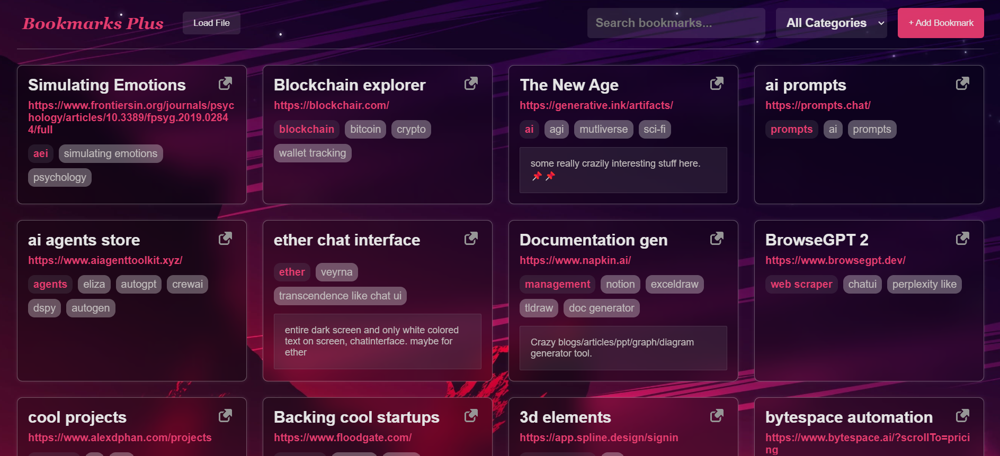
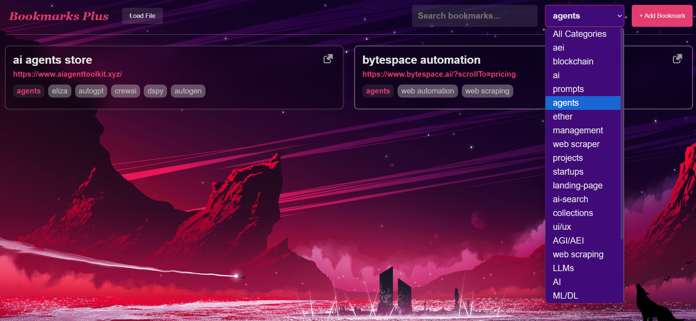

## Chrome Extension: **Info Manager Tool**

# 

### Overview

**Bookmarks-plus** is a Chrome extension that elevates your bookmarking experience. Categorize, tag, and add personalized notes to your bookmarks with ease. With locally stored data, everything is kept secure and private on your device.





---

### Features

#### 1. **Shortcut & Categorization:**

-   Quickly categorize your bookmarks via a shortcut key or create new categories on the fly.
-   Tag bookmarks with multiple keywords and add brief notes/memos for quick reference.

#### 2. **Local Data Storage:**

-   All bookmark data (categories, tags, and notes) is stored locally in a secure folder, ensuring privacy and fast access.

#### 3. **Dashboard:**

-   A sleek, modern dashboard displays all your bookmarks.
-   A dynamic search bar instantly filters results based on categories, tags, or keywords.

---

## Installation

1. Clone or download the repository.

```
git clone https://github.com/Madhav-MKNC/bookmarks-plus
```

3. Open Chrome and go to `chrome://extensions`.
4. Enable "Developer mode" at the top right.
5. Click “Load unpacked” and select the `bookmarks-plus/` folder.

---

# BONUS

***If you don't want to install a chrome extension and use a Github hosted static app instead:***

[saved-stuff.github.io](saved-stuff.github.io)

## **Note** for Non-Techies

Both the apps (chrome extension and github hosted app) are completely safe and secure (open source). Both use your Chrome Browser's *localStorage* for storing your stuff and since they both are just simple static apps you don't need to worry about any leaks. **NOTHING LIKE THAT EXISTS**. Just a locally hosted app.

### License

This project is licensed under the Apache License, Version 2.0, January 2004.  
See the full license text at: [LICENSE](LICENSE)

---

### Contributing

We welcome contributions! If you'd like to improve **Bookmarks-plus**, feel free to fork the repository, open issues, and submit pull requests.

---

### Contact

For any questions or suggestions, feel free to contact the developer:

**Developer**: [Madhav](https://x.com/5mknc5)
